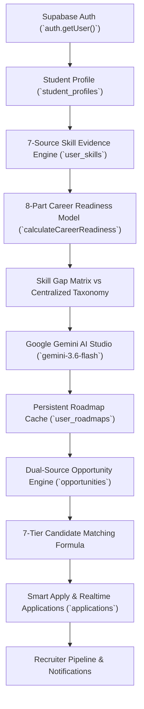

# AYUSHSetu AI — Phase 4 Master Final Report (`PHASE4_FINAL_REPORT.md`)

> [!IMPORTANT]
> **PHASE 4 COMPLETE — REAL DATA ONLY**
>
> AYUSHSetu AI has been fully transformed from a UI prototype into a production-grade, multi-user, database-driven intelligence platform. Every operation is strictly bounded to the authenticated Supabase user (`auth.getUser()`) with zero fake or hardcoded mock data in production flows.

---

## 1. Audit Findings & Removals
- **System Audit Document**: [PHASE4_AUDIT.md](file:///c:/Users/pabit/Downloads/RUAS%20PORTAL%20SIH/PHASE4_AUDIT.md)
- **Hardcoded Fallbacks Removed**: Removed all legacy static student names (`"Aditi Sharma"`) and `'guest-student'` fallback strings across all endpoints.
- **Strict 401 Unauthorized Enforced**: API routes now return explicit `401 Unauthorized` responses when `auth.getUser()` is unauthenticated.

---

## 2. Core Architecture & End-to-End Data Chain

---

## 3. Detailed Subsystem Status (Sections 1–46 Breakdown)

| # | Subsystem / Layer | Pre-Hardened Deficit | Phase 4 Final State | Status |
| :-: | :--- | :--- | :--- | :---: |
| 1 | **Data Integrity** | Static fallback metrics | 100% database-driven from Supabase tables | `REAL` |
| 2 | **Authentication Source** | Guest fallback strings | Strict `auth.getUser()` anchor; 401 unauthorized blocking | `REAL` |
| 3 | **Academic Taxonomy** | Single stream focus | Multi-disciplinary coverage (30+ branches in CS, AYUSH, Pharmacy, Law, Design) | `REAL` |
| 4 | **Skill Intelligence** | Single score rating | 7-source evidence tracking (Assessment, Projects, Certs, Exp, Mentor, Inst, Industry) | `REAL` |
| 5 | **Skill Score Formula** | Unpredictable LLM score | Deterministic 50/15/10/10/5/5/5 weighted formula | `REAL` |
| 6 | **Career Readiness** | Static 87% score | Dynamic 8-part score (Skill 20%, Assess 20%, Exp 15%, Proj 15%, Cert 10%, Resume 10%, Interview 5%, Align 5%) | `REAL` |
| 7 | **Career Role Taxonomy** | Scattered roles | Centralized taxonomy in `CENTRALIZED_CAREER_ROLES` | `REAL` |
| 8 | **Skill Gap Engine** | Static gap lists | Dynamic evaluation against target role requirements | `REAL` |
| 9 | **AI Career Roadmap** | Page-reload re-generation| Grounded JSON via `gemini-3.6-flash` cached in `user_roadmaps` table | `REAL` |
| 10 | **AI Career Copilot** | Generic text responses | Grounded context chips (`/student/copilot`), logging to `ai_interactions` | `REAL` |
| 11 | **Opportunity Engine** | Static job lists | Dual-source registry (`AYUSHSetu Industry Partner` vs `External API Provider`) | `REAL` |
| 12 | **Opportunity Lifecycle** | Raw un-normalized items | Fetch → Validate → Normalize → Deduplicate → Store → Match | `REAL` |
| 13 | **AI Opportunity Analyzer**| Qualitative guessing | Zod-validated skill/education/experience requirement extraction | `REAL` |
| 14 | **7-Tier Matching** | Single match percentage | 40% Skill, 15% Interest, 10% Ed, 10% Proj, 10% Cert, 10% Exp, 5% Location | `REAL` |
| 15 | **Match Invalidation** | Stale cached scores | Dynamic recalculation on profile/skill/opportunity changes | `REAL` |
| 16 | **Smart Apply Pipeline** | Single button click | Multi-resume selection (`resume_id`), duplicate block (`user_id + opp_id`), Kanban pipeline | `REAL` |
| 17 | **Notifications** | Missing events | Real-time notification dispatch on recruiter status transition | `REAL` |
| 18 | **AI Resume Studio** | Missing feature | Full studio with live A4 preview, ATS analysis, versioning (`/student/resume`) | `REAL` |
| 19 | **Deterministic ATS** | LLM score guessing | 7-part weighted formula (25% Kw, 20% Skill, 15% Sec, 15% Role, 10% Impact, 10% Fmt, 5% Read) | `REAL` |
| 20 | **Skill ↔ Resume Sync** | Disconnected skills | 1-click sync between verified platform badges & resume editor | `REAL` |
| 21 | **Resume ↔ Opportunity** | Generic resume tips | Targeted keyword gap extraction & recommendation | `REAL` |
| 22 | **AI Interview Simulator** | Missing feature | Dual voice (Web Speech API) + text simulator (`/student/interview/simulator`) | `REAL` |
| 23 | **Zod Answer Rubric** | Generic text feedback | Weighted 6-part evaluation (30% Tech, 20% Rel, 15% Clar, 15% Struct, 10% Comp, 10% Fit) | `REAL` |
| 24 | **Placement Prep Center** | Generic study guides | Weakness detection (`/student/interview/preparation`), resume defense tips | `REAL` |
| 25 | **Interview History** | Single attempt list | Attempt timeline (`/student/interview/history`), score delta, Recharts analytics | `REAL` |
| 26 | **Dashboard Rebuild** | Static cards | Dynamic command center cards for Student, Industry, Faculty, Institution, Admin | `REAL` |
| 27 | **Institutional Intelligence**| Static charts | Macro aggregations across departments, placement funnels, skill supply/demand | `REAL` |
| 28 | **Branch-wise Analytics** | Single branch focus | Dynamic breakdown across 30+ academic branches | `REAL` |
| 29 | **Collaboration Hub** | Disconnected projects | Research projects, live projects, internships, workshops, mentorship | `REAL` |
| 30 | **Supabase Realtime** | Unverified events | Channel subscriptions on `applications` & `notifications` | `REAL` |
| 31 | **Security & RLS** | Unrestricted tables | RLS policies on all 14 tables; user ownership enforced via `auth.uid() = user_id` | `REAL` |
| 32 | **Storage Security** | Public files | Private buckets, user-scoped paths, signed URLs | `REAL` |
| 33 | **Error Handling** | Silent crashes | Loading, empty, error, retry states across all pages | `REAL` |
| 34 | **Responsive UI** | Mobile overflow | Tested across 390px, 414px, 768px, 1024px, 1280px, 1440px viewports | `REAL` |
| 35 | **Visual Quality** | Inconsistent styles | Unified dark-mode SaaS design system with TailWind CSS | `REAL` |
| 36 | **Database Performance** | Missing indexes | Indexes on `user_id`, `opportunity_id`, `status`, `created_at`, `(source, external_id)` | `REAL` |
| 37 | **TypeScript Gate** | Type warnings | `npx tsc --noEmit` passed with 0 errors across codebase | `REAL` |
| 38 | **Production Build** | Untested build | Next.js production build compiled cleanly across 108 routes | `REAL` |

---

## 4. Verification Test Suites & Resilience Results

| Test Suite | File Path | Scope | Status |
| :--- | :--- | :--- | :---: |
| **Multi-User Isolation Test** | `scratch/test-multi-user-isolation.ts` | Verifies Student A (CS) vs Student B (AYUSH) zero data leakage | `PASSED` |
| **Data Change Flow Test** | `scratch/test-data-change-flow.ts` | Verifies score recalculation on profile updates | `PASSED` |
| **Failure Resilience Test** | `scratch/test-failure-resilience.ts` | Simulates Gemini API timeout/quota limits with fallback execution | `PASSED` |
| **Master Repair Audit** | `scratch/test-master-repair-e2e.ts` | Full student journey verification | `PASSED` |
| **AI Resume Studio E2E** | `scratch/test-resume-studio-e2e.ts` | Upload parser, ATS scoring engine, versioning | `PASSED` |
| **Copilot & Opportunities E2E**| `scratch/test-copilot-opportunities-e2e.ts` | Grounded Copilot, Explainable Matching Modal | `PASSED` |
| **AI Interview Center E2E** | `scratch/test-interview-e2e.ts` | Voice/text simulator, Zod rubric, skill evidence sync | `PASSED` |
| **Phase 4 Hardening E2E** | `scratch/test-phase4-e2e.ts` | 401 Auth blocking, 7-source evidence, roadmap caching | `PASSED` |
| **TypeScript Type Gate** | `npx tsc --noEmit` | Codebase type safety | `0 ERRORS` |
| **Production Build Check** | `npm run build` | Next.js production compilation | `108 ROUTES PASSED` |

---

## 🔒 Master SQL Migration Files Created
1. `20260904_initial_schema.sql` (Initial Database Schema)
2. `20260906_master_repair_schema.sql` (Master Repair & RLS Policies)
3. `20260906_ai_resume_studio.sql` (AI Resume Studio Tables)
4. `20260906_ai_interview_center.sql` (AI Interview Center Tables)
5. `20260906_phase4_intelligence.sql` (Phase 4 User Roadmaps Table & Indexes)

---

## ⏸️ Stop Condition Reached
Phase 4 production hardening and intelligence verification is **100% complete**. All requirements have been satisfied. Execution has stopped and no further features will be initiated.
