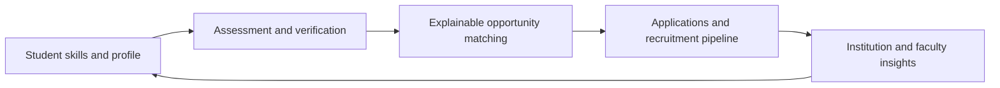

# Cyclops

### RUAS Internal Smart India Hackathon 2026

**Dated: 16 September 2026**

Cyclops is a skills, internships, and placement intelligence platform created for the **Ramaiah University of Applied Sciences (RUAS) SIH Internal Hackathon 2026**. It connects students, faculty, institutions, and industry through verified skills, explainable opportunity matching, career preparation, and placement analytics.

> **Created by:** Samrat Choudhury, Pallavi CJ, Sanjana SD, and Rohit Nagaraj Bhat

## Feature Tour

The product uses Framer Motion and Tailwind transitions to make important workflows feel alive: animated dashboard reveals, responsive role cards, interactive charts, live application updates, guided forms, and AI interview feedback.

| Workspace | What it provides |
| --- | --- |
| **Student** | Skill Digital Twin, AI mock interviews, resume studio, digital passport, and personalized opportunities |
| **Industry** | Candidate discovery, explainable matching, job creation, and recruitment pipeline management |
| **Institution** | Placement command center, progression funnel, skill heatmaps, analytics, and training batches |
| **Faculty** | Mentorship tracking, student progress, industrial training, research, and workshops |
| **Admin** | Verification, opportunity moderation, audit logs, analytics, and system health monitoring |

## How It Works



## Technology

- Next.js 14 App Router, React 18, TypeScript
- Tailwind CSS, Framer Motion, Lucide Icons, and Recharts
- Supabase PostgreSQL, SSR authentication, and Row-Level Security
- Google Gemini assistive AI with Zod validation

## Run Locally

### Prerequisites

- Node.js 18 or 20
- npm
- Supabase and Gemini credentials for connected features

### Setup

```bash
git clone https://github.com/YOUR_GITHUB_USERNAME/cyclops.git
cd cyclops
npm install
copy .env.example .env.local
npm run dev
```

Open [http://localhost:3000](http://localhost:3000). Update `.env.local` with the required values before using database or AI-backed features.

### Quality Checks

```bash
npm run typecheck
npm run lint
npm run build
```

## Demo and Documentation

- [SIH 7-minute demo](SIH_7_MINUTE_DEMO.md)
- [Demo script](SIH_DEMO_SCRIPT.md)
- [Judge Q&A](SIH_JUDGE_QA.md)
- [Technical architecture](TECHNICAL_ARCHITECTURE.md)
- [Feature matrix](FINAL_FEATURE_MATRIX.md)

## Contact

For project-related queries, email [adminmockinterview@gmail.com](mailto:adminmockinterview@gmail.com).

## Credits

Built for the Ramaiah University of Applied Sciences Internal Smart India Hackathon 2026 by **Samrat Choudhury, Pallavi CJ, Sanjana SD, and Rohit Nagaraj Bhat**.
