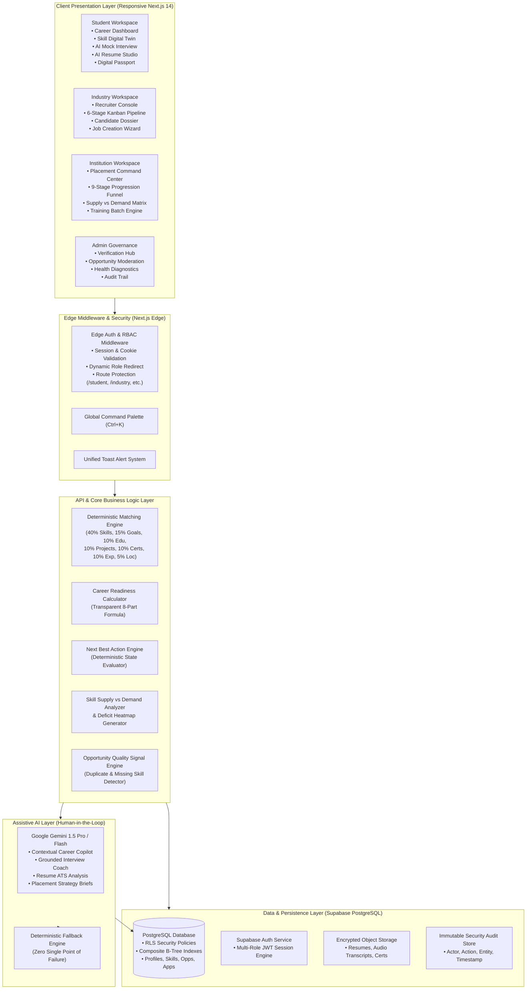

# AYUSHSetu AI — Technical Architecture & Systems Engineering
**System Version**: 1.0.0-PROD | **Framework**: Next.js 14 App Router | **Database**: Supabase PostgreSQL

AYUSHSetu AI is engineered as a high-performance, modular, multi-tenant talent intelligence platform connecting students, academic institutions, faculty mentors, and corporate recruiters.

---

## 1. System Architecture Diagram



---

## 2. Technology Stack & Specifications

| Layer | Component | Version / Specification | Rationale & Responsibility |
| :--- | :--- | :--- | :--- |
| **Frontend** | Next.js App Router | 14.2.15 | Server Components, fast SSR, zero-layout-shift routing |
| **Language** | TypeScript | 5.6.3 | Strict static typing, zero runtime type exceptions |
| **Styling** | Tailwind CSS | 3.4.14 | Centralized dark design system (`#020617`, `#0F172A`, `#10B981`) |
| **Animations** | Framer Motion | 11.11.9 | Subtle micro-interactions and accessible modal dialogs |
| **Database** | PostgreSQL | 15.x (Supabase) | ACID relational transactions, schema integrity, JSONB |
| **Auth** | Supabase SSR | 0.5.1 | Cookie-based session validation, PKCE flow, RLS context |
| **Security** | Row-Level Security | PostgreSQL RLS | Multi-tenant tenant isolation; Student A cannot see Student B |
| **AI Models** | Google Gemini API | 1.5 Pro / Flash | Natural language career advisory, interview evaluation |
| **Schema Validation**| Zod | 3.23.8 | Structured output validation for all external API payloads |
| **Charts & Radar** | Recharts | 2.13.0 | Skill Digital Twin radar graphs and placement funnel charts |
| **QR Engine** | QRCodeSVG | 4.0.1 | Client-side QR generation for instant passport sharing |

---

## 3. Core Architectural Modules

### 3.1 Deterministic 7-Dimension Matching Engine
Located in `lib/matching/engine.ts` and `app/api/industry/candidates/[id]/route.ts`.
Calculates match score $M \in [0, 100]$:
$$M = 0.40 \cdot S_{\text{skills}} + 0.15 \cdot S_{\text{interest}} + 0.10 \cdot S_{\text{edu}} + 0.10 \cdot S_{\text{proj}} + 0.10 \cdot S_{\text{cert}} + 0.10 \cdot S_{\text{exp}} + 0.05 \cdot S_{\text{loc}}$$
Where:
- $S_{\text{skills}}$: Jaccard similarity weighted by verification status (1.15 multiplier for verified credentials).
- Output is completely explainable with sub-dimension percentages.

### 3.2 Deterministic Next Best Action Engine
Located in `lib/matching/actions.ts`.
Evaluates student database records sequentially:
1. Profile Incomplete $\to$ "Complete Your Academic Profile"
2. Career Goal Missing $\to$ "Declare Your Target Career Goal"
3. No Skill Assessment Taken $\to$ "Take Your Core Skill Assessment"
4. Critical Skill Gap Exists $\to$ "Bridge Skill Gap: {skill_name}"
5. Resume Missing $\to$ "Build Your Verified Resume"
6. Strong Profile / Zero Applications $\to$ "Explore Matching Opportunities"
7. Completed Applications / Pending Interview $\to$ "Practice with AI Mock Interview"

### 3.3 Security, Row-Level Security (RLS) & IDOR Protection
PostgreSQL tables enforce policies ensuring that:
- Students can only view and mutate their own profile, skills, and application records.
- Recruiters can only mutate opportunities belonging to their own organization.
- Institution directors can view aggregated cohort statistics for their affiliated students.
- System administrators have global read/audit permissions with immutable logging.

---

## 4. Database Schema Structure

```
profiles
├── id (UUID, PK)
├── full_name (TEXT)
├── role (TEXT: STUDENT, INDUSTRY, INSTITUTION, FACULTY, ADMIN)
├── academic_stream (TEXT)
├── department (TEXT)
├── course (TEXT)
├── career_goal (TEXT)
└── verification_status (TEXT)

user_skills
├── id (UUID, PK)
├── user_id (UUID, FK -> profiles.id)
├── skill_name (TEXT)
├── category (TEXT)
├── proficiency_score (INTEGER, 0-100)
├── confidence_score (INTEGER, 0-100)
└── verification_status (SELF_DECLARED, INSTITUTION_VERIFIED, INDUSTRY_VERIFIED)

opportunities
├── id (UUID, PK)
├── organization_id (UUID, FK -> organizations.id)
├── title (TEXT)
├── type (INTERNSHIP, FULL_TIME, RESEARCH_PROJECT)
├── academic_branch (TEXT)
├── required_skills (TEXT[])
├── stipend_amount (NUMERIC)
├── moderation_status (PUBLISHED, PENDING_REVIEW, REJECTED, SUSPENDED)
└── deadline (TIMESTAMPTZ)

applications
├── id (UUID, PK)
├── user_id (UUID, FK -> profiles.id)
├── opportunity_id (UUID, FK -> opportunities.id)
├── status (APPLIED, UNDER_REVIEW, SHORTLISTED, INTERVIEW, SELECTED, REJECTED)
└── match_score (INTEGER)

rejection_reasons
├── id (UUID, PK)
├── application_id (UUID, FK -> applications.id)
├── reason_category (SKILL_GAP, ELIGIBILITY, EXPERIENCE, ROLE_CLOSED, OTHER)
├── feedback_notes (TEXT)
└── logged_at (TIMESTAMPTZ)
```

---

## 5. Deployment & Production Operations

- **Deployment Target**: Vercel Serverless Edge Platform
- **Database Target**: Supabase Managed PostgreSQL Instance (AWS ap-south-1 Mumbai)
- **CI/CD Pipeline**: Automated static analysis (`npx tsc --noEmit`), linting (`npm run lint`), and unit verification (`npx tsx scratch/test-phase8-master.ts`) prior to production deployment.
